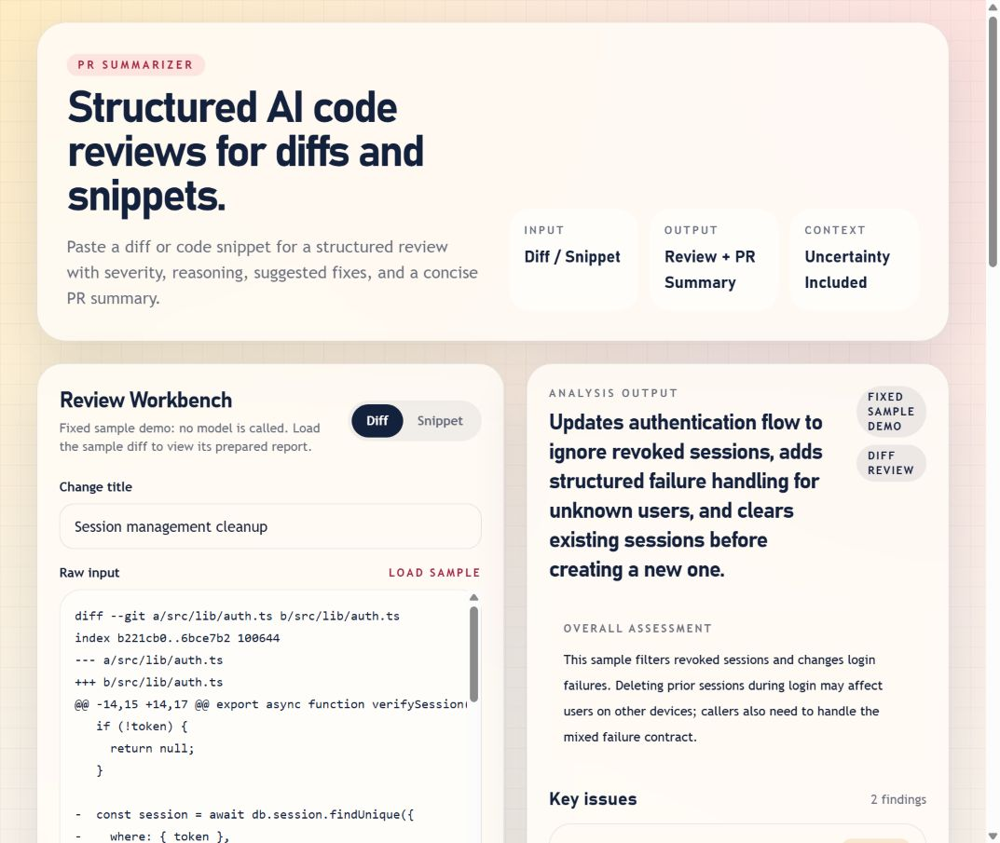

# PR Summarizer

A small web app for reviewing pasted Git diffs and code snippets. It returns structured findings, suggested fixes, uncertainty, and a pull request summary that can be copied or downloaded as Markdown.

## Current status

The default installation runs a **fixed sample demo**, with no API key or model call. Only the included sample diff is accepted in demo mode. Live reviews require an OpenAI API key and a separate access token. There is no hosted demo or published release yet.

The app does not fetch repositories, execute code, run tests on submitted code, or save review history. AI findings can be wrong or incomplete. Confidence values are model estimates, not measured probabilities.



This screenshot shows the fixed sample demo, not a live model result.

## Run locally

Use Node.js **24.x** and npm **11.x**. `.nvmrc` records the locally verified Node version. Git is required for the source scanning command.

```sh
git clone https://github.com/YangOwen007/pr-summarizer.git
cd pr-summarizer
npm ci
npm run dev
```

Open [localhost:3000](http://localhost:3000). Choose **Load sample**, then **Generate structured review**. No environment file is required for the demo. In PowerShell, use `npm.cmd` if script execution policy blocks `npm`.

## Environment

For live mode, copy [.env.example](.env.example) to `.env.local` and set:

| Variable | Default | Purpose |
| --- | --- | --- |
| `USE_DEMO_ANALYSIS` | `true` | Set exactly `false` to opt into live reviews. Other nonempty values fail readiness. |
| `OPENAI_API_KEY` | unset | Required only in live mode; server-side OpenAI credential. |
| `ANALYSIS_ACCESS_TOKEN` | unset | Required in live mode; random secret of at least 32 characters. Trusted reviewers enter it in the UI. |
| `OPENAI_MODEL` | `gpt-4.1-mini` | Optional model supporting Chat Completions structured outputs. Empty values use the default. |

Generate an access token privately with `node -e "console.log(require('node:crypto').randomBytes(32).toString('hex'))"`. Do not commit it, put it in a URL, or use a `NEXT_PUBLIC_` environment variable. Live configuration without a key and valid token returns HTTP 503. No automatic fallback hides a live configuration failure.

## Implementation

The stack is Next.js App Router, React, TypeScript, Tailwind CSS, Zod, and the OpenAI Node SDK. There is no database or external service in demo mode.

```text
Browser workbench -> POST /api/analyze -> configuration + access checks
  -> bounded JSON input + Zod validation -> sample fixture OR OpenAI
  -> validated structured result -> UI / clipboard / Markdown
```

- [page.tsx](src/app/page.tsx) handles the workbench, request state, and exports. Reports retain the submitted title and mode.
- [analysis-schema.ts](src/lib/analysis-schema.ts) defines the shared contract. Empty findings are valid; the schema does not force a model to invent issues.
- [route.ts](src/app/api/analyze/route.ts) normalizes errors and checks credentials before any paid request.
- [request-guard.ts](src/lib/request-guard.ts) limits streamed body bytes and live request concurrency.
- [review-engine.ts](src/lib/review-engine.ts) separates review instructions from untrusted input and validates model output using [structured outputs](https://developers.openai.com/api/docs/guides/structured-outputs).
- `GET /api/health` reports configuration readiness and demo/live mode. It does not verify provider availability or billing.

Pasted input is limited to 40-20,000 characters; JSON bodies are capped at 100,000 bytes. Live calls have a 45-second timeout, no automatic retries, and a 3,000-token output cap. A process accepts at most 10 live calls per minute and one at a time. These are deliberately modest limits for a shared-token prototype.

## Checks

```sh
npm run check
npm audit --omit=dev --audit-level=high
npm audit
```

`check` runs lint, type generation/typecheck, regression tests, a local secret-pattern scan, a production build, and production HTTP smoke tests. Individual commands are `lint`, `typecheck`, `test`, `scan:secrets`, `build`, and `test:smoke`. Build first before running the smoke tests separately. `npm run scan:secrets -- --build` also checks generated browser and server text artifacts.

Tests cover clean reviews, input limits, JSON errors, matching demo fixtures, access checks, readiness, request limiting, export provenance, and mocked provider success/failure/refusal. They do not establish live model quality. The smoke script starts and stops isolated production servers without calling OpenAI.

[CI](.github/workflows/ci.yml) repeats these checks with pinned action revisions and scans full Git history using a pinned, checksum-verified Gitleaks CLI. A production dependency audit blocks CI; the full audit remains visible as a nonblocking step because of the upstream tooling issue below. See the [Actions page](https://github.com/YangOwen007/pr-summarizer/actions) for current results.

## Deployment

See [DEPLOYMENT.md](DEPLOYMENT.md) for Vercel and Node server setup, verification, rollback, and recovery. A hosting account or a provisioned Node server is still needed; no deployment has been made. Demo deployment needs no model account. Live mode additionally needs OpenAI API access, billing, and privately distributed review tokens.

## Security and privacy

Demo input stays within the app server and returns a prepared fixture. Live input and title are sent to OpenAI with `store: false`; this does not override the provider's retention policies. See [OpenAI data controls](https://developers.openai.com/api/docs/guides/your-data). Do not submit secrets, personal data, or code you lack permission to share.

The application has no persistence, analytics, third-party browser scripts, or input logging. Hosting platforms and the provider may retain request metadata. Access tokens stay in browser memory, are sent in an authorization header, and must be protected with HTTPS outside localhost. Responses are not cached, and provider error details are not returned to callers.

See [SECURITY.md](SECURITY.md) for scope, reporting, and credential handling. The lightweight local scanner can miss credentials; Gitleaks and manual review are complementary checks, not a guarantee.

## Known limitations and next work

- A shared access token is suitable for a few trusted reviewers, not individual accounts. Revoking it revokes everyone.
- Limits are per process and reset on restart. Multiple server instances can exceed them collectively. Add a shared quota store and user authentication before enabling broad public live access; configure provider spend controls as well.
- Prompt separation reduces instruction confusion but does not prove resistance to prompt injection. Review quality needs a labeled evaluation set and actual model runs.
- As of the local audit on 2026-10-06, production dependencies have no reported advisories; five high-severity tooling findings remain in the `braces` -> `micromatch` -> `fast-glob` -> Next ESLint chain. The available forced fix downgrades Next's ESLint configuration. Keep linting trusted repository files and monitor [the upstream advisory](https://github.com/advisories/GHSA-vfj7-8cjw-p6xm); do not describe the full dependency audit as clean.
- Browser coverage and automated accessibility checks are limited. The app has keyboard focus, labeled inputs, pressed-state toggles, live results, and error announcements, but no accessibility certification.
- No license has been chosen. Public visibility alone does not grant an open-source license; the owner needs to decide reuse terms before adding one.

The next product step is an evaluation set with clean changes and known regressions, followed by stronger access and quota controls if live reviews will be shared more widely.
